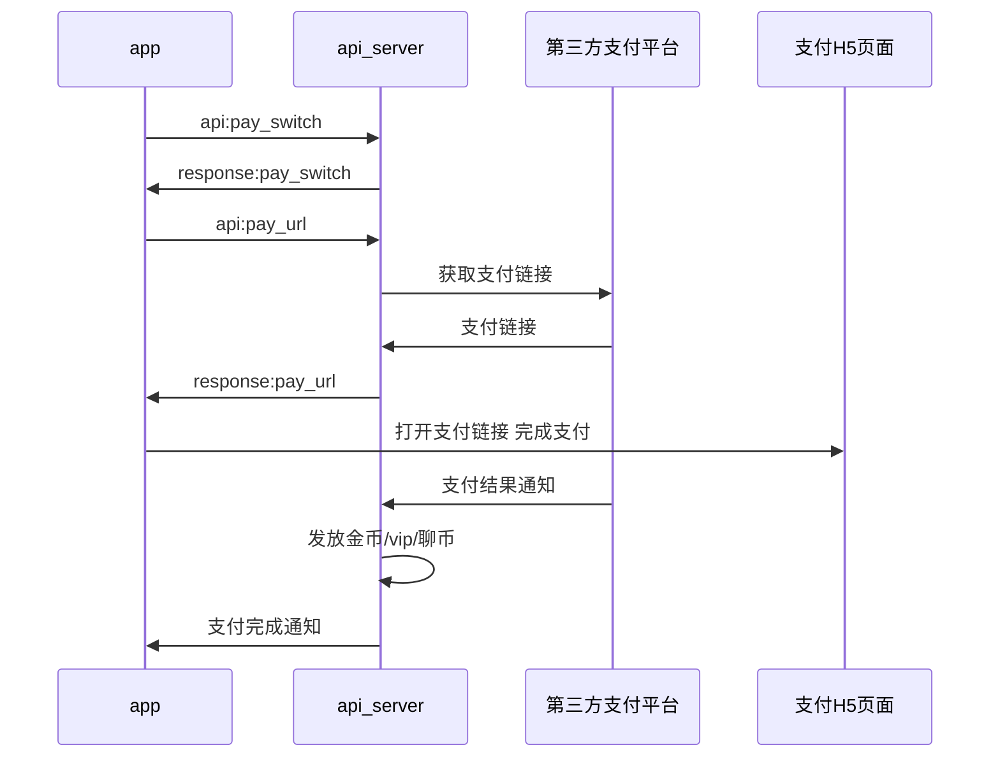

```mermaid
sequenceDiagram
    participant app
    participant api_server
    participant 第三方支付平台
    participant 支付H5页面
    app->>api_server: api:pay_switch
    api_server->>app: response:pay_switch
    app->>api_server: api:pay_url
    api_server->>第三方支付平台: 获取支付链接
    第三方支付平台->>api_server: 支付链接
    api_server->>app: response:pay_url
    app->>支付H5页面: 打开支付链接 完成支付
    第三方支付平台->>api_server: 支付结果通知
    api_server->>api_server: 发放金币/vip/聊币
    api_server->>app: 支付完成通知
```