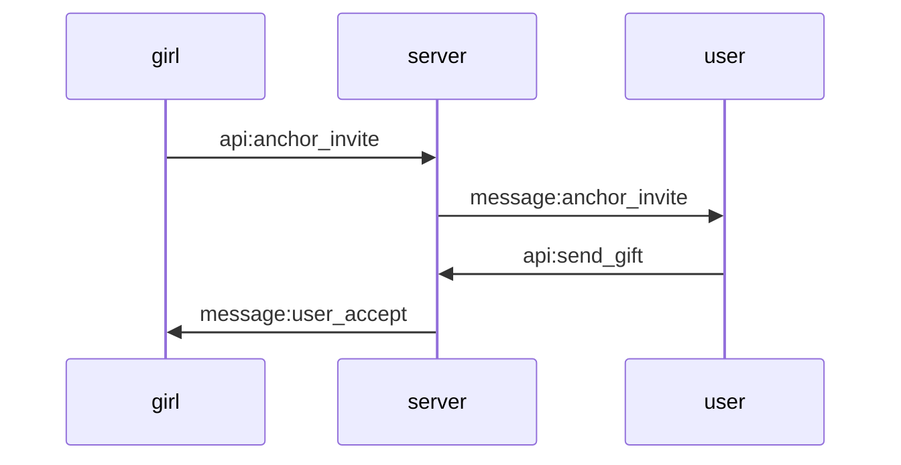
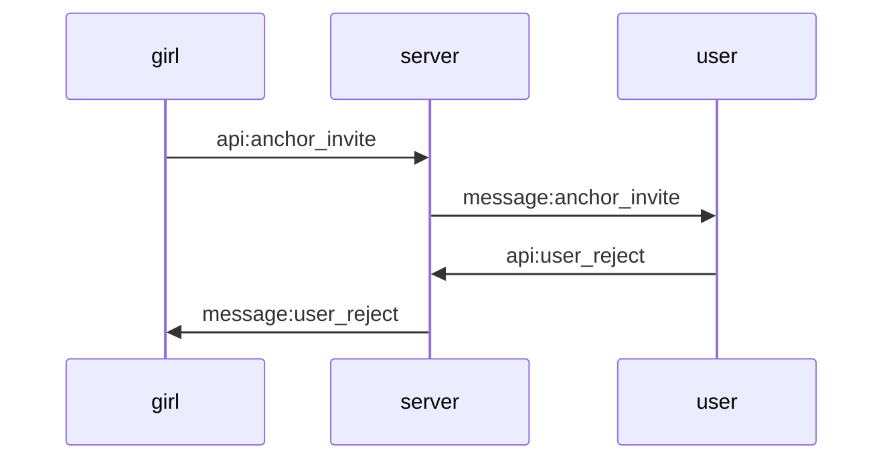
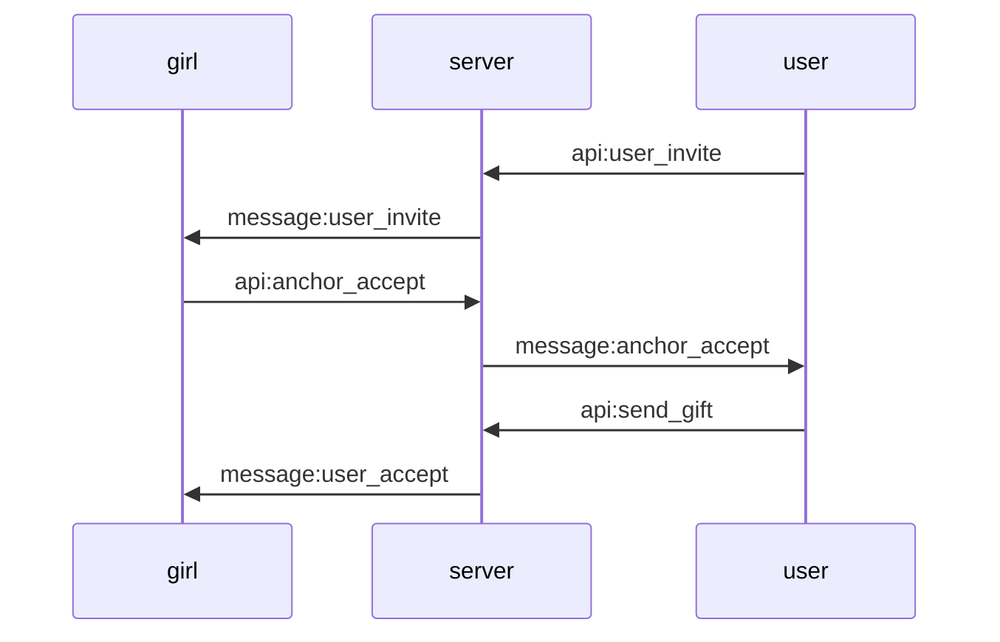
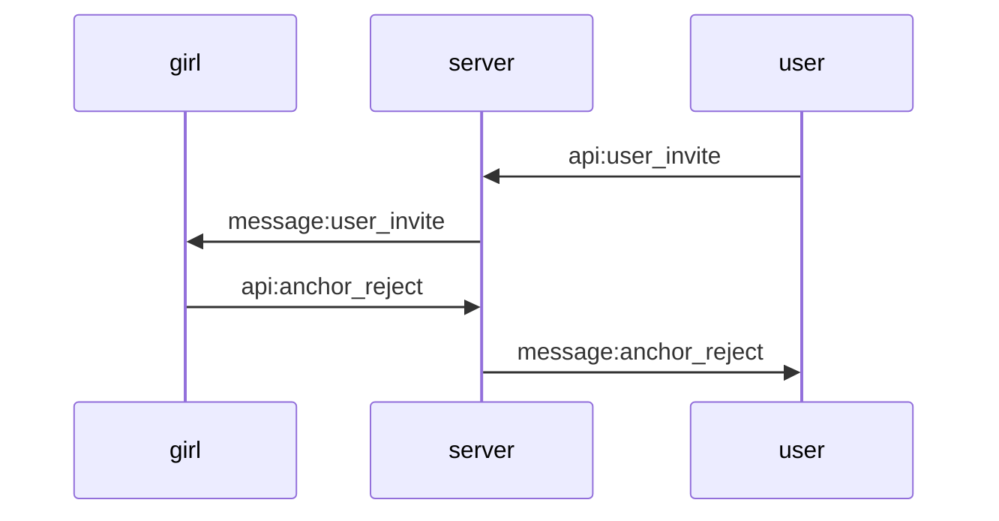

# 交互式表演服务端接口说明

### 现有接口改动
1. api:send_gift
2. api:paycall/call 返回内容增加字段showEnable(0|1), 标识对方是否可试用交互式表演功能.
3. message:call 即content_type=4时 增加showEnable(0|1), 标识对方是否可试用交互式表演功能.

#### 客户端检查本方是否可用交互式表演功能, 双方都可用时显示相关ui

### api
| 名称 | URI | 文档链接 |
| :----- | :----| :----: |
|主播邀请| /app/show/anchor_invite.php |[doc](anchor_invite.md)|
|用户拒绝| /app/show/user_reject.php |[doc](user_reject.md)|
|用户邀请| /app/show/user_invite.php |[doc](user_invite.md)|
|主播接受| /app/show/anchor_accept.php |[doc](anchor_accept.md)|
|主播拒绝| /app/show/anchor_reject.php |[doc](anchor_reject.md)|

### message
名称|格式|描述
---|---|---
id              | int    | 评论id
topic_id        | int    | 动态id
uid             | int    | 发布人uid
nickname        | string | 发布人昵称
head_image      | string | 发布人头像
content         | string | 内容
t_create        | int    | 发布时间utc秒

### 主播发起 用户接受

### 主播发起 用户拒绝

### 用户发起 主播接受

### 用户发起 主播拒绝
