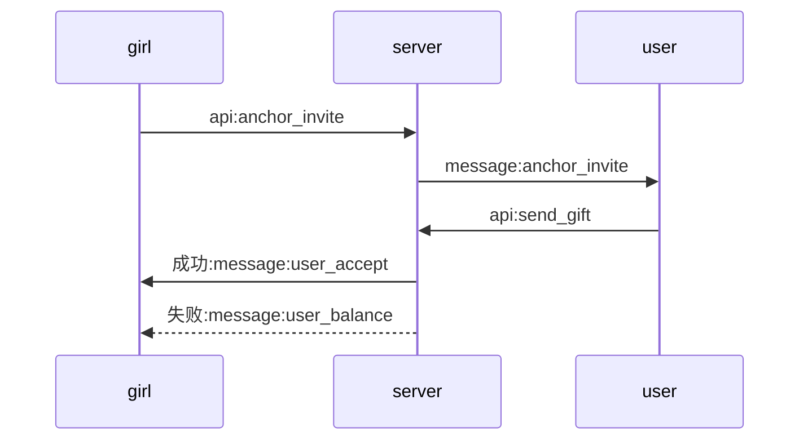
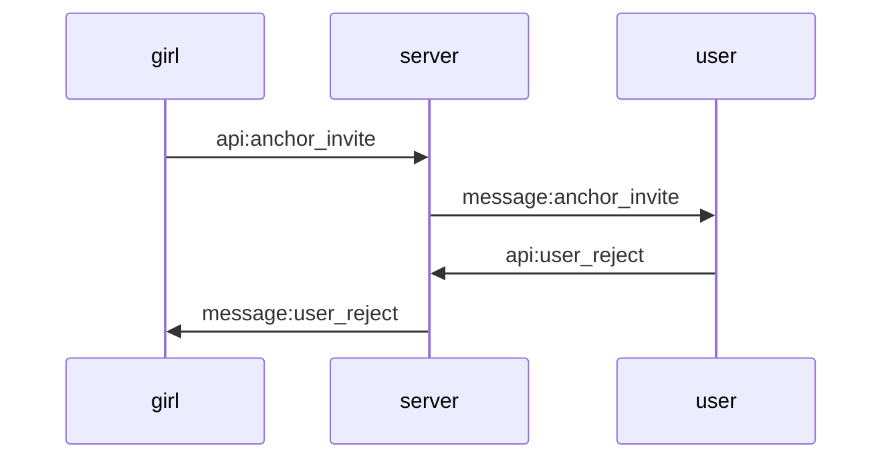
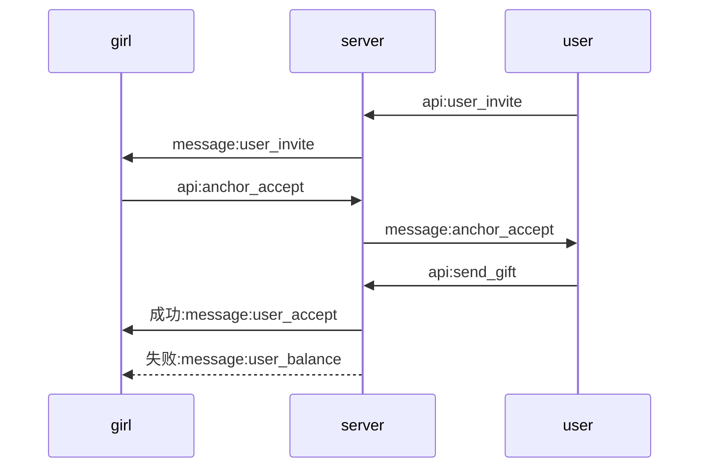
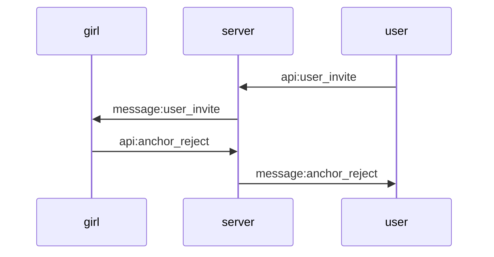

# 交互式表演服务端接口说明

### 现有接口改动
1. [api:send_gift](/paycall/gifts.md) 增加show类型礼物
2. api:paycall/call 返回内容增加字段showEnable(0|1), 标识对方是否可试用交互式表演功能.
3. api:paycall/answer 返回内容增加字段showEnable(0|1), 标识对方是否可试用交互式表演功能.

#### 客户端检查本方是否可用交互式表演功能, 双方都可用时显示相关ui

### api
| 名称 | URI | 文档链接 |
| :----- | :----| :----: |
|主播邀请| /app/show/anchor_invite.php |[doc](anchor_invite.md)|
|用户拒绝| /app/show/user_reject.php |[doc](user_reject.md)|
|用户邀请| /app/show/user_invite.php |[doc](user_invite.md)|
|主播接受| /app/show/anchor_accept.php |[doc](anchor_accept.md)|
|主播拒绝| /app/show/anchor_reject.php |[doc](anchor_reject.md)|

### message
名称|格式|描述
---|---|---
uid             | int    | 发送者uid
receive_uid     | int    | 接受人uid
ctime           | int    | utc秒
gid             | int    | 表演礼物id
show_id         | int    | 表演id
chat_type       | int    | 见下面chat_type说明

### chat_type
message_type|value|desc
---|---|---
anchor_invite|51|主播邀请用户
user_invite|52|用户邀请主播
anchor_accept|53|主播同意表演
user_accept|54|用户同意送礼观看表演
anchor_reject|55|主播拒绝表演
user_reject|56|用户拒绝送礼
user_balance|57|用户金币不足

### 交互流程
------
#### 1.主播发起 用户接受

#### 2.主播发起 用户拒绝

#### 3.用户发起 主播接受

#### 4.用户发起 主播拒绝
